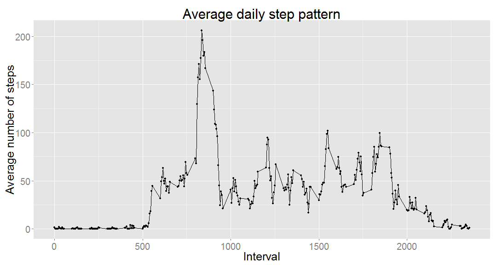
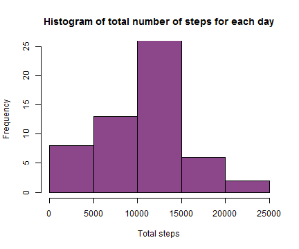
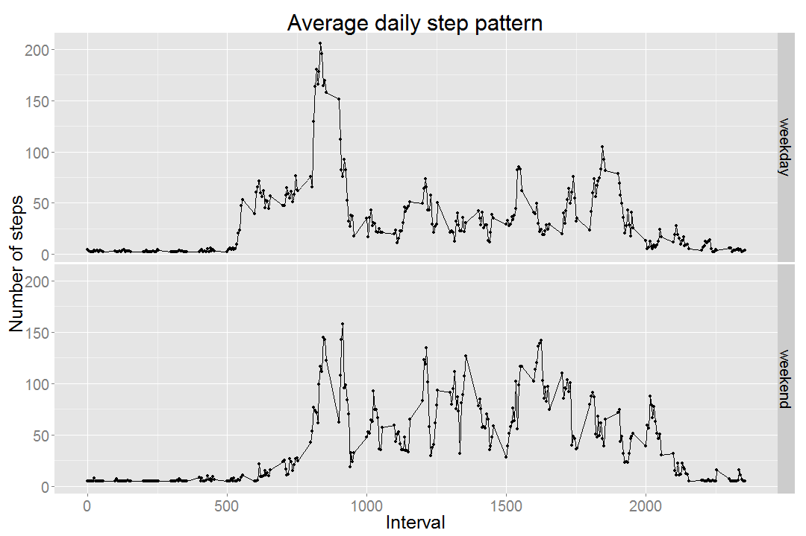

```r
library(ggplot2)
library(reshape)
library(reshape2)
```


```r
setwd("D:/My Documents/Coursera Data Science/reproducible_research/Assignment1")
dataset <- read.csv("D:/My Documents/Coursera Data Science/reproducible_research/Assignment1/activity.csv", sep = ",")
dataset$date <- as.Date(dataset$date)
```

##1) What is the mean total number of steps taken per day? 

###1.1) Number of steps taken per day 


```r
totalStepsDay <- aggregate(dataset$steps, list(dataset$date), sum, na.rm = TRUE)
colnames(totalStepsDay) <- c("date", "totalsteps")
totalStepsDay
```

```
##          date totalsteps
## 1  2012-10-01          0
## 2  2012-10-02        126
## 3  2012-10-03      11352
## 4  2012-10-04      12116
## 5  2012-10-05      13294
## 6  2012-10-06      15420
## 7  2012-10-07      11015
## 8  2012-10-08          0
## 9  2012-10-09      12811
## 10 2012-10-10       9900
## 11 2012-10-11      10304
## 12 2012-10-12      17382
## 13 2012-10-13      12426
## 14 2012-10-14      15098
## 15 2012-10-15      10139
## 16 2012-10-16      15084
## 17 2012-10-17      13452
## 18 2012-10-18      10056
## 19 2012-10-19      11829
## 20 2012-10-20      10395
## 21 2012-10-21       8821
## 22 2012-10-22      13460
## 23 2012-10-23       8918
## 24 2012-10-24       8355
## 25 2012-10-25       2492
## 26 2012-10-26       6778
## 27 2012-10-27      10119
## 28 2012-10-28      11458
## 29 2012-10-29       5018
## 30 2012-10-30       9819
## 31 2012-10-31      15414
## 32 2012-11-01          0
## 33 2012-11-02      10600
## 34 2012-11-03      10571
## 35 2012-11-04          0
## 36 2012-11-05      10439
## 37 2012-11-06       8334
## 38 2012-11-07      12883
## 39 2012-11-08       3219
## 40 2012-11-09          0
## 41 2012-11-10          0
## 42 2012-11-11      12608
## 43 2012-11-12      10765
## 44 2012-11-13       7336
## 45 2012-11-14          0
## 46 2012-11-15         41
## 47 2012-11-16       5441
## 48 2012-11-17      14339
## 49 2012-11-18      15110
## 50 2012-11-19       8841
## 51 2012-11-20       4472
## 52 2012-11-21      12787
## 53 2012-11-22      20427
## 54 2012-11-23      21194
## 55 2012-11-24      14478
## 56 2012-11-25      11834
## 57 2012-11-26      11162
## 58 2012-11-27      13646
## 59 2012-11-28      10183
## 60 2012-11-29       7047
## 61 2012-11-30          0
```

###1.2) Histogram of total number of steps taken each day 


```r
hist(totalStepsDay$totalsteps, main = "Histogram of total number of steps for each day", xlab = "Total steps", ylab = "Frequency", xlim = c(0, 25000), ylim = c(0,25), col="firebrick")
```

 

###1.3) The mean and median of total number of steps per day: 

```r
mean(totalStepsDay$totalsteps)
```

```
## [1] 9354.23
```

```r
median(totalStepsDay$totalsteps)
```

```
## [1] 10395
```

##2) What is the average daily pattern? 

###2.1) Time series plot of the 5-minute interval and the average number of steps taken, averaged across all days


```r
avgStepsDay <- aggregate(dataset$steps, list(dataset$interval), mean, na.rm = TRUE)
colnames(avgStepsDay) <- c("interval", "avgsteps")
#avgStepsDay
```


```r
p <- qplot(avgStepsDay$interval, avgStepsDay$avgsteps, xlab = "Interval", ylab = "Average number of steps", main = "Average daily step pattern")
q <- p + geom_line(lwd=0.5) + theme(text = element_text(size=25))
q
```

 

###2.2) Which 5-minute interval, on average across all the days in the dataset, contains the maximum number of steps?


```r
ordered <- avgStepsDay[order(avgStepsDay$avgsteps, decreasing=TRUE), ]
ordered[1,]
```

```
##     interval avgsteps
## 104      835 206.1698
```

##3) Inputing missing values. 

###3.1) Calculate and report the total number of missing values in the dataset (i.e. the total number of rows with NAs)


```r
ok <- complete.cases(dataset)
dim(dataset[!(ok), ])
```

```
## [1] 2304    3
```


###3.2) Devise a strategy for filling in all of the missing values in the dataset.

First of all, let's have a look at the data corresponding to those missing values. After some analysis, we see that there are 5 days for which the number of steps is missing: 


```r
notComplete <- dataset[!(ok), ]
unique(notComplete$date)
```

```
## [1] "2012-10-01" "2012-10-08" "2012-11-01" "2012-11-04" "2012-11-09"
## [6] "2012-11-10" "2012-11-14" "2012-11-30"
```

So we will replace the NAs with the average number of steps in the day after (or before) the day containing NAs (for ex. the NAs in 2012-10-01 will be replaced with the average number of steps from 2012-10-02 etc). Note that this is done here manually but it can of course set up in a loop. 


```r
sub1 <- subset(dataset, dataset$date == "2012-10-02", select = "steps")
dataset[is.na(dataset) & dataset$date == "2012-10-01"] <- mean(sub1$steps)

sub2 <- subset(dataset, dataset$date == "2012-10-09", select = "steps")
dataset[is.na(dataset) & dataset$date == "2012-10-08"] <- mean(sub2$steps)

sub3 <- subset(dataset, dataset$date == "2012-11-02", select = "steps")
dataset[is.na(dataset) & dataset$date == "2012-11-01"] <- mean(sub3$steps)

sub4 <- subset(dataset, dataset$date == "2012-11-05", select = "steps")
dataset[is.na(dataset) & dataset$date == "2012-11-04"] <- mean(sub4$steps)

sub5 <- subset(dataset, dataset$date == "2012-11-08", select = "steps")
dataset[is.na(dataset) & dataset$date == "2012-11-09"] <- mean(sub5$steps)

sub6 <- subset(dataset, dataset$date == "2012-10-11", select = "steps")
dataset[is.na(dataset) & dataset$date == "2012-11-10"] <- mean(sub6$steps)

sub7 <- subset(dataset, dataset$date == "2012-11-15", select = "steps")
dataset[is.na(dataset) & dataset$date == "2012-11-14"] <- mean(sub7$steps)

sub1 <- subset(dataset, dataset$date == "2012-11-29", select = "steps")
dataset[is.na(dataset) & dataset$date == "2012-11-30"] <- mean(sub1$steps)
```

###3.3) Create a new dataset that is equal to the original dataset but with the missing data filled in.

This is our new `dataset`. 

###3.4) Histogram of the total number of steps taken each day and Calculate and report the mean and median total number of steps taken per day. Do these values differ from the estimates from the first part of the assignment? What is the impact of imputing missing data on the estimates of the total daily number of steps?


```r
totalStepsDay <- aggregate(dataset$steps, list(dataset$date), sum, na.rm = TRUE)
colnames(totalStepsDay) <- c("date", "totalsteps")
hist(totalStepsDay$totalsteps, main = "Histogram of total number of steps for each day", xlab = "Total steps", ylab = "Frequency", xlim = c(0, 25000), ylim = c(0,25), col="orchid4")
```

 

The mean and median of total number of steps per day: 


```r
mean(totalStepsDay$totalsteps)
```

```
## [1] 10249.1
```

```r
median(totalStepsDay$totalsteps)
```

```
## [1] 10571
```

These values differ from the estimates in the first part of the assignment. After inputing the missing values, the block corresponding to the interval (0,5000) steps changed, its value almost halved. 

##4) Are there differences in the activity patterns between weekdays and weekends? 

###4.1) Create a new factor variable in the dataset with two levels - "weekday" and "weekend" indicating whether a given date is a weekday or weekend day


```r
dataset$day_type <- ifelse(weekdays(dataset$date) %in% c("Saturday", "Sunday"), "weekend", "weekday")
head(dataset)
```

```
##    steps       date interval day_type
## 1 0.4375 2012-10-01        0  weekday
## 2 0.4375 2012-10-01        5  weekday
## 3 0.4375 2012-10-01       10  weekday
## 4 0.4375 2012-10-01       15  weekday
## 5 0.4375 2012-10-01       20  weekday
## 6 0.4375 2012-10-01       25  weekday
```

###4.2) Panel plot containing a time series plot of the 5-minute interval (x-axis) and the average number of steps taken, averaged across all weekday days or weekend days (y-axis)


```r
avgsteps <- aggregate(dataset$steps, list(dataset$interval, dataset$day_type), mean, na.rm = TRUE)
p <- qplot(avgsteps$Group.1, avgsteps$x, data = avgsteps, xlab = "Interval", ylab = "Number of steps", main = "Average daily step pattern", facets = Group.2 ~.)
q <- p + geom_line(lwd=0.5) + theme(text = element_text(size=25))
q
```

 
